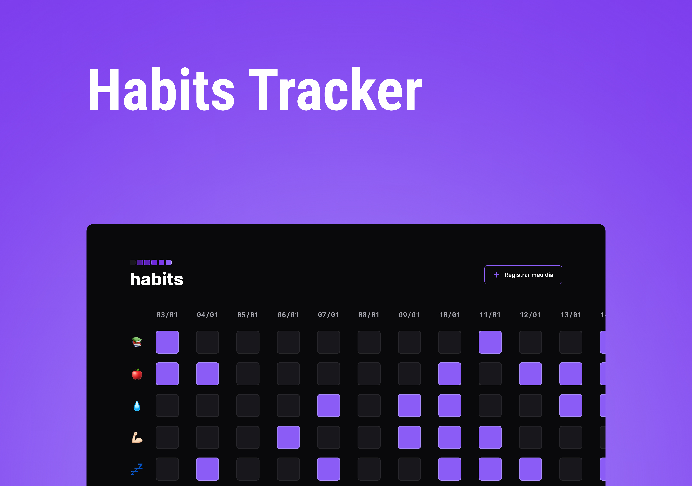

<h1 align="center"> Habits Tracker </h1>

 Projeto realizado durante o evento NLW Setup oferecido pela Rocketseat para ensino de tecnologias WEB.  

  <a href="#-tecnologias">Tecnologias</a>&nbsp;&nbsp;&nbsp;|&nbsp;&nbsp;&nbsp;
  <a href="#-projeto">Projeto</a>&nbsp;&nbsp;&nbsp;|&nbsp;&nbsp;&nbsp;

  

 

  

## 🚀 Tecnologias

Esse projeto foi desenvolvido com as seguintes tecnologias:

- HTML
- CSS
- JavaScript
- Figma

## 💻 Projeto

O Habits Tracker é um app para te ajudar a monitorar os seus hábitos diários.

- [Visite o projeto online](https://gabriellytegon.github.io/habits-tracker/)

---